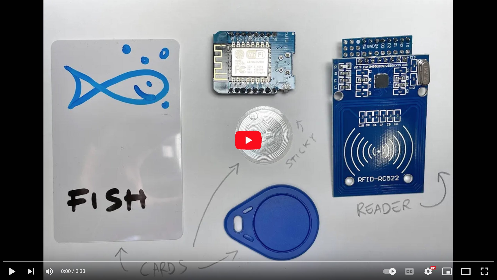

# Flashboard Reader Node Prototype

This is the first prototype of a Flashboard Reader, an RFID sensor that forms
the building block of the [Flashboard](https://github.com/flashboard), an
interactive, speaking smart board that can be used at all ages to teach
virtually any concepts.

The node is based on the [ESPHome](https://esphome.io) framework for easy
integration with MQTT.

[](https://www.youtube.com/watch?v=T4SWnModmsQ)

- [Flashboard Reader Node Prototype](#flashboard-reader-node-prototype)
    - [Hardware Requirements](#hardware-requirements)
    - [Software Requirements](#software-requirements)
    - [Edit settings](#edit-settings)
    - [Usage](#usage)
        - [Run an MQTT Server](#run-an-mqtt-server)
        - [Run an MQTT Client to Monitor Incoming Messages](#run-an-mqtt-client-to-monitor-incoming-messages)
        - [Upload the Code to the Reader](#upload-the-code-to-the-reader)
        - [Read a Tag](#read-a-tag)
    - [License](#license)

## Hardware Requirements

- A desktop computer or a RaspberryPi (or similar) to host the MQTT server
- ESP8266 board (e.g., [WeMos D1 Mini Lite](https://www.wemos.cc/en/latest/d1/d1_mini_lite.html))
- An RC522 RFID 13.56MHz reader (e.g., [RFID Kit](https://www.amazon.it/ZkeeShop-sensore-lettore-compatibile-Raspberry/dp/B08BZPLWV2))
- Some jumper wires or an [adapter proto shield](https://www.wemos.cc/en/latest/d1_mini_shield/protoboard.html) (check the wiring [here](pcbs/rc522-wemos.fzz), open the file with [Fritzing](https://fritzing.org/))
- Some 13.56MHz RFID tags (e.g., [plastic cards](https://www.amazon.it/MIFARE-Classic®-controllo-accesso-confezione/dp/B01F52VQZ0/), [keychain tokens](https://www.amazon.it/YARONG-pezzi-impermeabile-ISO14443A-tecnologia/dp/B01DAAO1KG/), [stickers](https://www.amazon.it/YSSHUI-compatibile-completamente-programmabile-confezione/dp/B089D32BHH/))

## Software Requirements

- Python 3.9+
- MQTT server (e.g., [Mosquitto](https://mosquitto.org/))
- [Poetry](https://python-poetry.org/) for Python dependency management

## Edit settings

Create a `secrets.yaml` file with at least the following settings

```yaml
hotspot_ssid: "Flashboard Sensor Wifi"
hotspot_pass: "*************"
wifi_pass: "*************" .        # your wifi password
wifi_ssid: "***********" .          # your wifi network name
mqtt_broker: hostname               # hostname of your MQTT server
# mqtt_user: "username"             # optional (depends on your setup)
# mqtt_pass: "***********"          # optional (depends on your setup)
```

## Usage

### Run an MQTT Server

```bash
$ mosquitto
1644242572: mosquitto version 2.0.14 starting
1644242572: Using default config.
1644242572: Starting in local only mode. Connections will only be possible from clients running on this machine.
1644242572: Create a configuration file which defines a listener to allow remote access.
1644242572: For more details see https://mosquitto.org/documentation/authentication-methods/
1644242572: Opening ipv4 listen socket on port 1883.
1644242572: Opening ipv6 listen socket on port 1883.
1644242572: mosquitto version 2.0.14 running
```

### Run an MQTT Client to Monitor Incoming Messages

```bash
$ mosquitto_sub -h 192.168.1.103 -v -t "flashboard/#
...
```

### Upload the Code to the Reader

```bash
$ git clone https://github.com/flashboard/flashboard-node-proto
$ cd flashboard-node-proto
$ poetry install
$ poetry run esphome compile reader.yaml
$ poetry run esphome upload reader.yaml
```

### Read a Tag

Pleace a card nearby the reader and check the MQTT client's output.

```bash
$ mosquitto_sub -h 192.168.1.103 -v -t "flashboard/#
...
flashboard/status online
flashboard/tag/8C:AA:B5:1B:51:46 { "mac": 9C:EE:B5:AB:51:46, "tag": "61-3B-B3-1A" }
...
```

## License

```
GNU GENERAL PUBLIC LICENSE Version 3, 29 June 2007

Copyright (C) 2007 Free Software Foundation, Inc. <https://fsf.org/>
Everyone is permitted to copy and distribute verbatim copies
of this license document, but changing it is not allowed.
```
